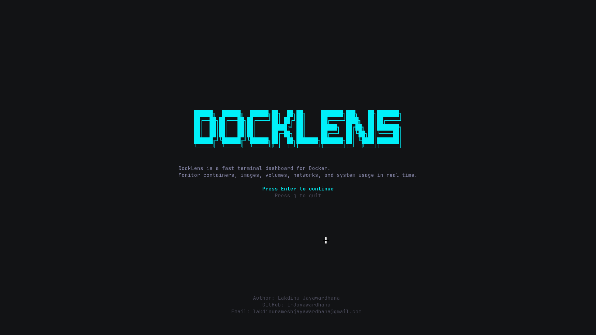

# 🐳 DockLens


**DockLens** is a blazing-fast, lightweight Terminal UI (TUI) for monitoring and managing Docker environments.

Built entirely in Go, it interacts directly with the Docker Engine SDK to provide real-time insights without the heavy resource footprint of traditional desktop applications. Designed for developers who live in the terminal.

---

## 🖼️ UI Preview



---

## 🆕 Latest Upgrades

- **🚀 v1.0.0 Release**: First public release with install script, version command, and all core features.
- **🎬 Welcome Screen**: New startup page with DockLens branding, quick description, and `enter` to continue.
- **👤 Developer Credits**: Welcome screen footer now includes developer, GitHub username, and contact email in a clean horizontal layout.
- **💾 System Disk Usage**: System tab now shows real Docker `system df` usage values (images, volumes, cache, reclaimable).
- **🧹 Working System Prune**: System Prune now runs real Docker prune actions and shows reclaim summary.
- **🧩 Tab UI Fixes**: Top tab boxes now render with complete bottom borders.
- **📜 Live Container Logs**: Running containers can fetch and display real logs directly in the detail view.

---

## ✨ Features

- **🚢 Container Management**: View all containers (running and stopped) with real-time status badges.
- **📊 Live Resource Monitoring**: Dynamic CPU and Memory usage percentages with visual progress bars.
- **📜 Integrated Logs**: Scroll through recent container logs directly within the TUI.
- **🖼️ Image Explorer**: List local Docker images, tags, and sizes.
- **📦 Volume & Network Insights**: Simple overview of your Docker storage and networking layers.
- **⚡ Auto-Refresh**: 3-second live refresh cycle keeps your view perfectly synced with the Docker daemon.
- **⌨️ Vim-Style Navigation**: Fluid navigation using `j`/`k` or arrow keys.
- **🎨 Modern Aesthetics**: A premium "Command Center" interface powered by Lip Gloss.

---

## 🛠️ Tech Stack

* **Language:** Go 1.25+
* **TUI Framework:** [Bubble Tea](https://github.com/charmbracelet/bubbletea)
* **Styling:** [Lip Gloss](https://github.com/charmbracelet/lipgloss)
* **Docker API:** [Docker Engine SDK for Go](https://github.com/moby/moby)

---

## 🚀 Getting Started

### Prerequisites

* Go 1.25 or higher installed.
* Docker daemon running.
* Permissions to access `/var/run/docker.sock` (typically by being in the `docker` group).

---

### Quick Install (Latest Release)

Install with one command:

```bash
curl -fsSL https://raw.githubusercontent.com/L-Jayawardhana/DockLens/main/scripts/install.sh | sh
```

Verify installed version:

```bash
docklens --version
```

---

## ⌨️ Controls

| Key | Action |
|-----|--------|
| `tab` | Switch between Tabs (Containers, Images, etc.) |
| `j` / `k` | Navigate items in the left panel |
| `J` / `K` | Scroll through logs in the detail panel |
| `enter` | Open actions menu for selected item |
| `?` | Toggle help overlay |
| `q` | Quit DockLens |

---

## 🤝 Contributing

Contributions make the open-source community an amazing place to learn, inspire, and create. Any contributions you make are **greatly appreciated**.

1. Fork the Project
2. Create your Feature Branch (`git checkout -b feature/AmazingFeature`)
3. Commit your Changes (`git commit -m 'Add some AmazingFeature'`)
4. Push to the Branch (`git push origin feature/AmazingFeature`)
5. Open a Pull Request

---

## 📄 License

Distributed under the MIT License. See `LICENSE` for more information.
